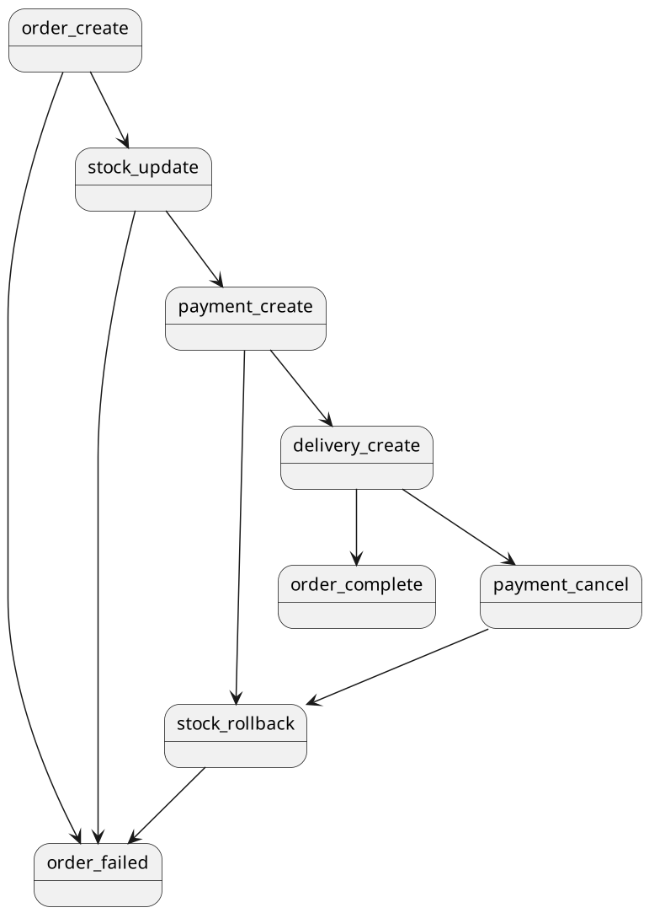
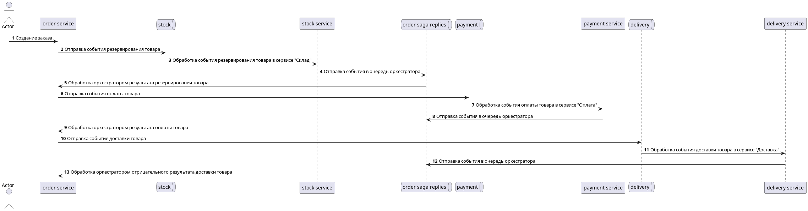
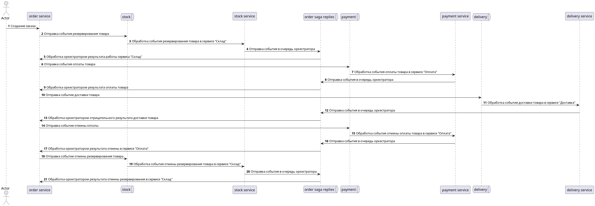

### Запуск приложения

#### Запуск сервисов kafka
```shell
kubectl create namespace abdalovalex-l7-kafka && helm install kafka-service helm/kafka --namespace abdalovalex-l7-kafka
```

#### Запуск сервиса "Заказ"
```shell
kubectl create namespace abdalovalex-l7-order-service && helm install order-service helm/order-service --namespace abdalovalex-l7-order-service
```

#### Запуск сервиса "Склад"
```shell
kubectl create namespace abdalovalex-l7-stock-service && helm install stock-service helm/stock-service --namespace abdalovalex-l7-stock-service
```

#### Запуск сервиса "Оплата"
```shell
kubectl create namespace abdalovalex-l7-payment-service && helm install payment-service helm/payment-service --namespace abdalovalex-l7-payment-service
```

#### Запуск сервиса "Доставка"
```shell
kubectl create namespace abdalovalex-l7-delivery-service && helm install delivery-service helm/delivery-service --namespace abdalovalex-l7-delivery-service
```

1. До установки запускаются следующие ресурсы:
   1. Запуск БД
   2. Установка ConfigMap и Secret
   3. Запуск Job c миграциями(Только юля тех сервисов, для которых необходима миграция). Job ждет запуска БД.
2. Запуск Deployment

Для порядка запуска используются initContainer и helm hook.  
ConfigMap и Secret забирает приложение(инструмент SpringCloudKubernetes), для этого создан ServiceAccount 
с ограниченными ролями для приложения.

### Запуск тестов
```shell
newman run ./tests/tests.json
```
```
newman

otus_l7

→ Создать заказ
  POST http://arch.homework/order-service/orders/create [201 Created, 147B, 37ms]
  ✓  Создание заказа 1

→ Получить заказ
  GET http://arch.homework/order-service/orders/15 [200 OK, 251B, 20ms]
  ✓  Проверка получения заказа

→ Создать заказ с большим кол-вом товара
  POST http://arch.homework/order-service/orders/create [201 Created, 147B, 15ms]
  ✓  Создание заказа 2

→ Получить заказ с ошибкой
  GET http://arch.homework/order-service/orders/16 [200 OK, 245B, 13ms]
  ✓  Проверка получения заказа

┌─────────────────────────┬──────────────────┬──────────────────┐
│                         │         executed │           failed │
├─────────────────────────┼──────────────────┼──────────────────┤
│              iterations │                1 │                0 │
├─────────────────────────┼──────────────────┼──────────────────┤
│                requests │                4 │                0 │
├─────────────────────────┼──────────────────┼──────────────────┤
│            test-scripts │                8 │                0 │
├─────────────────────────┼──────────────────┼──────────────────┤
│      prerequest-scripts │                6 │                0 │
├─────────────────────────┼──────────────────┼──────────────────┤
│              assertions │                4 │                0 │
├─────────────────────────┴──────────────────┴──────────────────┤
│ total run duration: 4.1s                                      │
├───────────────────────────────────────────────────────────────┤
│ total data received: 220B (approx)                            │
├───────────────────────────────────────────────────────────────┤
│ average response time: 21ms [min: 13ms, max: 37ms, s.d.: 9ms] │
└───────────────────────────────────────────────────────────────┘

```

### Удаление

#### Kafka

```shell
helm uninstall kafka -n abdalovalex-l7-kafka  
kubectl delete namespace abdalovalex-l7-kafka 
````

#### Сервис "Заказ"
```shell
helm uninstall order-service -n abdalovalex-l7-order-service  
kubectl delete namespace abdalovalex-l7-order-service
kubectl delete clusterrolebinding order-service
kubectl delete clusterrole order-service 
````

#### Сервис "Склад"
```shell
helm uninstall stock-service -n abdalovalex-l7-stock-service
kubectl delete namespace abdalovalex-l7-stock-service
kubectl delete clusterrolebinding stock-service
kubectl delete clusterrole stock-service
```

#### Сервис "Оплата"
```shell
helm uninstall payment-service -n abdalovalex-l7-payment-service
kubectl delete namespace abdalovalex-l7-payment-service
kubectl delete clusterrolebinding payment-service
kubectl delete clusterrole payment-service
```

#### Сервис "Доставка"
```shell
helm uninstall delivery-service -n abdalovalex-l7-delivery-service
kubectl delete namespace abdalovalex-l7-delivery-service
kubectl delete clusterrolebinding delivery-service
kubectl delete clusterrole delivery-service
```

### Схема взаимодействия сервисов
Сага реализована в виде оркестратора, с помощью конечного автомата (Spring statemachine).


Схемы отрисованы с помощью plantUML. Исходники можно посмотреть в директории scheme 

#### Положительный сценарий


1. Пользователь отправляет запрос на создание заказа. Создается заказ со статусом "Ожидается"
2. Отправка события резервирования товара
3. Обработка события резервирования товара в сервисе "Склад"
4. Отправка события в очередь оркестратора
5. Обработка оркестратором результата резервирования товара

6. Отправка события оплаты товара
7. Обработка события оплаты товара в сервисе "Оплата"
8. Отправка события в очередь оркестратора
9. Обработка оркестратором результата оплаты товара

10. Отправка событие доставки товара
11. Обработка события доставки товара в сервисе "Доставка"
12. Отправка события в очередь оркестратора
13. Обработка оркестратором отрицательного результата доставки товара. Смена статуса заказа на "Завершен"

#### Отрицательный сценарий


1. Пользователь отправляет запрос на создание заказа. Создается заказ со статусом "Ожидается"
2. Отправка события резервирования товара
3. Обработка события резервирования товара в сервисе "Склад"
4. Отправка события в очередь оркестратора
5. Обработка оркестратором результата резервирования товара
6. Отправка события оплаты товара
7. Обработка события оплаты товара в сервисе "Оплата"
8. Отправка события в очередь оркестратора
9. Обработка оркестратором результата оплаты товара
10. Отправка событие доставки товара
11. Обработка события доставки товара в сервисе "Доставка"
12. Отправка события в очередь оркестратора
13. Обработка оркестратором отрицательного результата доставки товара
14. Отправка событие отмены оплаты
15. Обработка события отмены оплаты товара в сервисе "Оплата"
16. Отправка события в очередь оркестратора
17. Обработка оркестратором результата отмены в сервисе "Оплата"
18. Отправка событие отмены резервирования товара
19. Обработка события отмены резервирования товара в сервисе "Склад"
20. Отправка события в очередь оркестратора
21. Обработка оркестратором результата отмены резервирования. Смена статуса заказа на "Неудача"